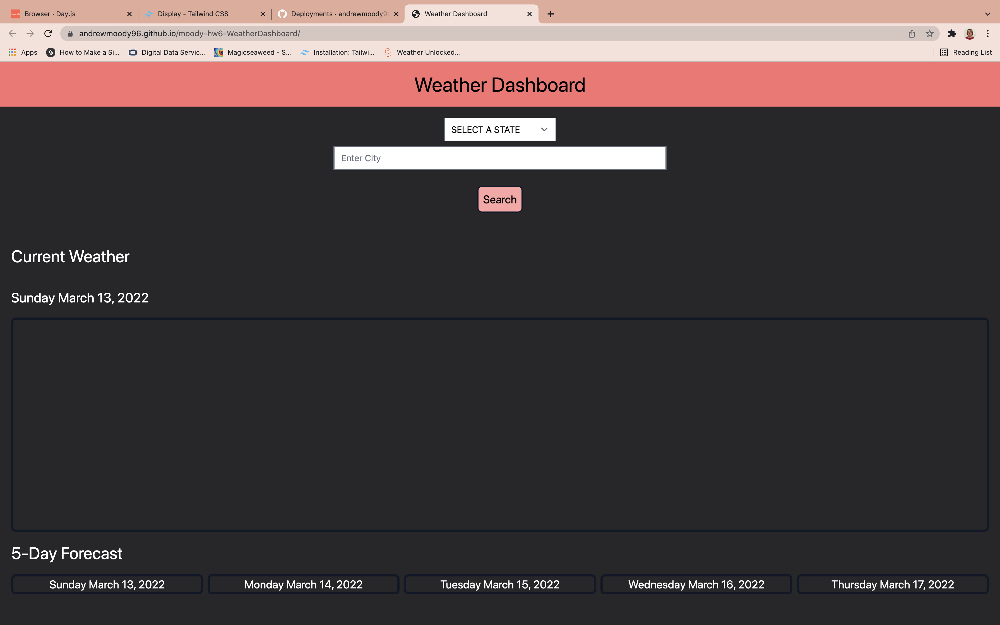
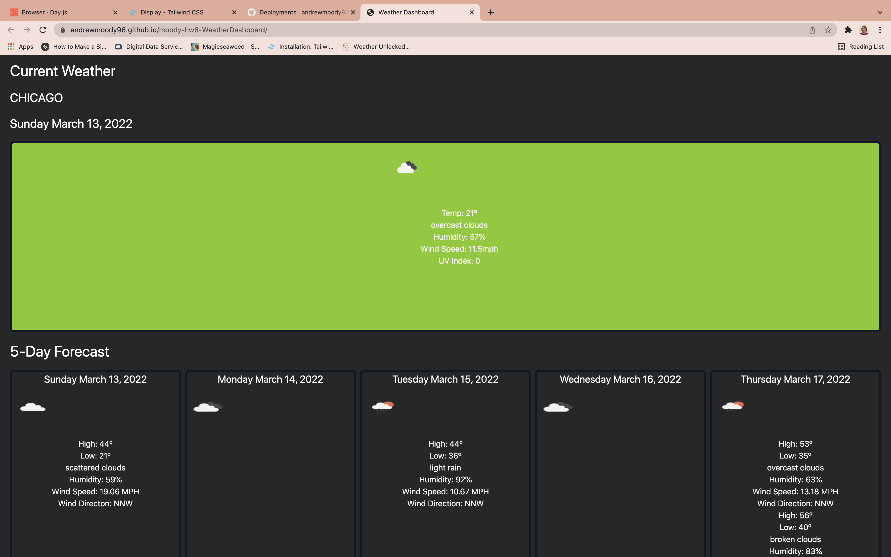
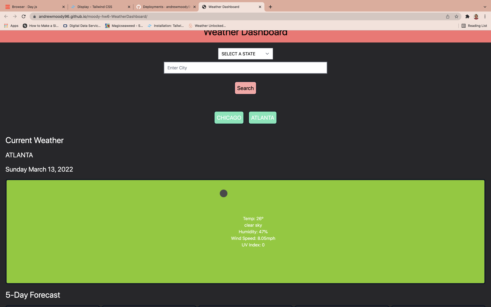
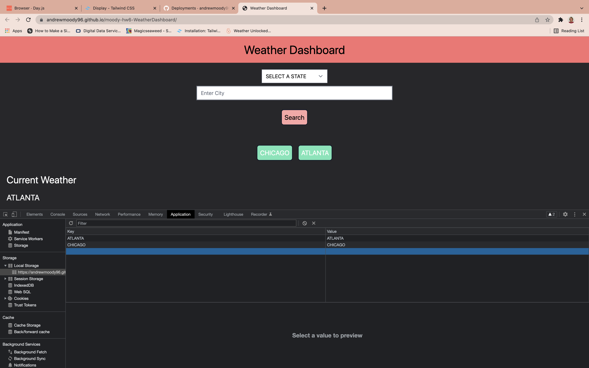

# moody-hw6: Weather Dashboard

## Description
This app allows users to input a city and state to get both current weather and a 5-day forecast for the selected city. Users are presented with a colored background based on the severity of the UV Index. Green indicates low, yellow indicates moderate, red indicates high.

 
Upon completing a search, the city is saved so the user can reload the information for that city with a single click of a button. 

 

## Accessing the Application
---
You may access the application via these links:
 

GitHub Pages: https://andrewmoody96.github.io/moody-hw6-WeatherDashboard/
 

Repository: https://github.com/andrewmoody96/moody-hw6-WeatherDashboard 

 

## Screenshots
---

 

## Issues
---
1. Need to run the function again using the saved values in local storage.

2. Polish UI